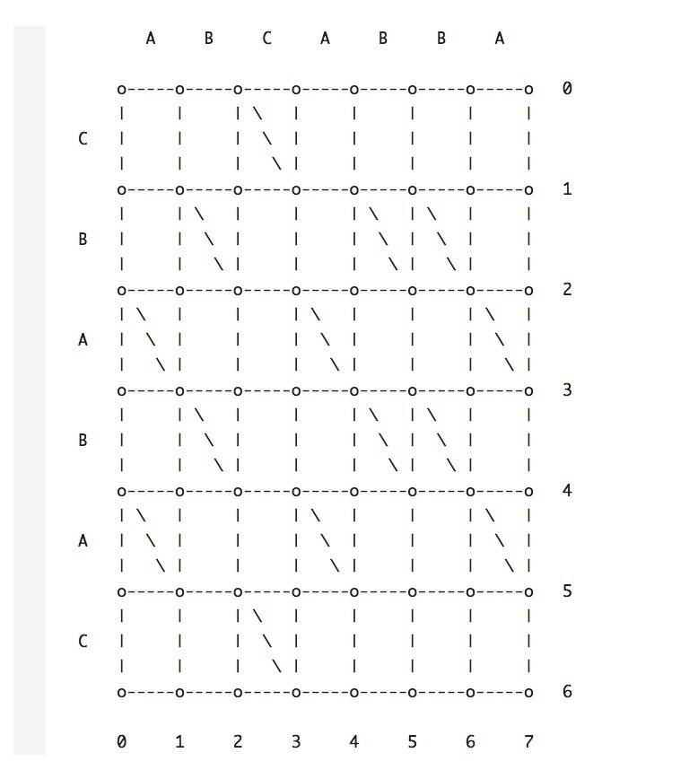
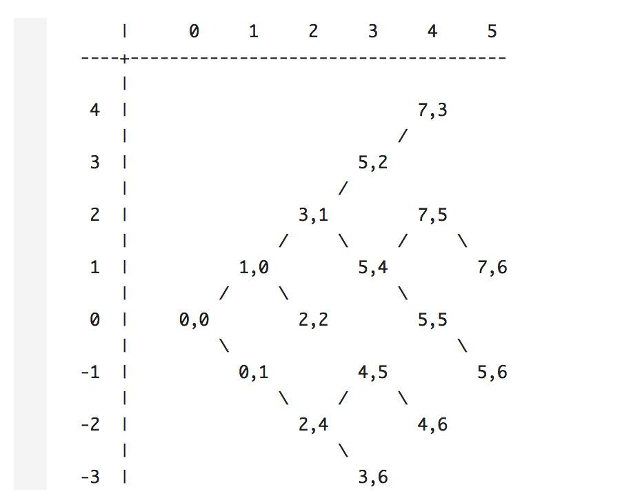

# [转载]Git 是怎样生成 diff 的：Myers 算法
原文链接：[https://cjting.me/2017/05/13/how-git-generate-diff/](https://cjting.me/2017/05/13/how-git-generate-diff/)


diff 是我们每天都要使用的一个功能，每次提交时，我都习惯先用 `git diff --cached` 看看这次提交更改了些什么，确定没问题，然后再 `git commit`。git 生成的 diff 非常直观，直观到我从来都没有去思考过 diff 是怎么生成的，觉得这应该是很简单的一件事，两个文件做个对比，不就行了。
<!-- more -->

## 什么是直观的 diff

我们先简单定义一下什么是 diff：diff 就是目标文本和源文本之间的区别，也就是将源文本变成目标文本所需要的操作。

git 为我们生成的 diff 是很直观易懂的，一看就知道我们对文件进行了哪些改动。但是，实际上，diff 生成是一个非常复杂的问题。

举个简单的例子，源文本为 `ABCABBA`，目标文本为 `CBABAC`，他们之间的 diff 其实有无穷多种（我们以字符为单位，一般情况下是以行为单位）。比如

```text
1.  - A       2.  - A       3.  + C
    - B           + C           - A
      C             B             B
    - A           - C           - C
      B             A             A
    + A             B             B
      B           - B           - B
      A             A             A
    + C           + C           + C
```

上面三种都是有效的 diff，都可以将源文本变成目标文本，但是第二种和第三种没有第一种看起来“直观”。

所以，我们需要个算法，生成“直观”的 diff，怎么样才叫“直观”呢？

- 删除后新增，比新增后删除要好，也就是说，上面的例子 2 比例子 3 看起来要直观

- 当修改一块代码时，整块的删除然后新增，比删除新增交叉在一起要好，例如：

  ```text
    Good: - one            Bad: - one
          - two                 + four
          - three               - two
          + four                + five
          + five                + six
          + six                 - three
  ```

  新增或删除的内容应该和代码结构相呼应，例如下面的例子，左边我们可以很直观地看出新增了一个inspect 方法。

  ```text
    Good: class Foo                   Bad:    class Foo
            def initialize(name)                def initialize(name)
              @name = name                        @name = name
            end                             +   end
        +                                   +
        +   def inspect                     +   def inspect
        +     @name                         +     @name
        +   end                                 end
          end                                 end
  ```

  

除了直观以外，diff 还需要短，这一点是好理解的，我们希望 diff 反应的是把源文本变成目标文本需要用的最少的操作。

那么，现在的问题就是：怎样寻找最短的直观的 diff？

## diff 与图搜索

”寻找最短的直观的 diff” 是一个非常模糊的问题，首先，我们需要把这个问题抽象为一个具体的数学问题，然后再来寻找算法解决。

抽象的过程交给算法科学家了，抽象的结果是：**寻找 diff 的过程可以被表示为图搜索**。

什么意思呢？还是以两个字符串，src=**ABCABBA**，dst=**CBABAC** 为例，根据这两个字符串我们可以构造下面一张图，横轴是 src 内容，纵轴是 dst 内容。

那么，图中每一条从左上角到右下角的路径，都表示一个 diff。向右表示“删除”，向下表示”新增“，对角线则表示“原内容保持不动“。



比如，我们选择这样一条路径：

1. (0, 0) -> (1, 0)
2. (1, 0) -> (2, 0) -> (3, 1)
3. (3, 1) -> (3, 2) -> (4, 3) -> (5, 4)
4. (5, 4) -> (6, 4) -> (7, 5)
5. (7, 5) -> (7, 6)

这条路径代表的 diff 如下。

```text
- A
- B
  C
+ B
  A
  B
- B
  A
+ C
```

现在，“寻找 diff” 这件事，被抽象成了“寻找图的路径”了。那么，“最短的直观的” diff 对应的路径有什么特点呢？

- 路径长度最短（对角线不算长度）
- 先向右，再向下（先删除，后新增）

## Myers 算法

Myers 算法就是一个能在大部分情况产生”最短的直观的“ diff 的一个算法，算法原理如下。  
首先，定义参数 `d` 和 `k`，d 代表路径的长度，`k` 代表当前坐标 `x - y` 的值。定义一个”最优坐标“的概念，最优坐标表示 d 和 k 值固定的情况下，x 值最大的坐标。x 大，表示向右走的多，表示优先删除。  
还是用上面那张图为例。我们从坐标 `(0, 0)` 开始，此时，`d=0`，`k=0`，然后逐步增加 `d`，计算每个 `k` 值下对应的最优坐标。  
因为每一步要么向右（x + 1），要么向下（y + 1），对角线不影响路径长度，所以，当 d=1 时，k 只可能有两个取值，要么是 `1`，要么是 `-1`。  
当 `d=1`，`k=1` 时，最优坐标是 `(1, 0)`。  
当 `d=1`，`k=-1` 时，最优坐标是 `(0, 1)`。  
因为 d=1 时，k 要么是 1，要么是 -1，当 d=2 时，表示在 d=1 的基础上再走一步，k 只有三个可能的取值，分别是 `-2`，`0`，`2`。  
当 `d=2`，`k=-2` 时，最优坐标是 `(2, 4)`。  
当 `d=2`，`k=0` 时，最优坐标是 `(2, 2)`。  
当 `d=2`，`k=2` 时，最优坐标是 `(3, 1)`。  
以此类推，直到我们找到一个 `d` 和 `k` 值，达到最终的目标坐标 `(7, 6)`。
下图横轴代表 d，纵轴代表 k，中间是最优坐标，从这张图可以清晰的看出，当 `d=5`，`k=1` 时，我们到达了目标坐标 (7, 6)，因此，”最短的直观的“路径就是 `(0, 0) -> (1, 0) -> (3, 1) -> (5, 4) -> (7, 5) -> (7, 6)`，对应的 diff 如下。   

```text
- A
- B
  C
+ B
  A
  B
- B
  A
+ C
```




现在我们可以知道，其实 Myers 算法是一个典型的”动态规划“算法，也就是说，父问题的求解归结为子问题的求解。要知道 d=5 时所有 k 对应的最优坐标，必须先要知道 d=4 时所有 k 对应的最优坐标，要知道 d=4 时的答案，必须先求解 d=3，以此类推，和 01 背包问题很是相似。

## 实现

算法原理知道以后，实现便是一件简单的事情了，[myers-diff](https://github.com/cj1128/myers-diff) 仓库是我使用 Go 实现的一个版本，基本流程如下：

1. 迭代 d，d 的取值范围为 0 到 n+m，其中 n 和 m 分别代表源文本和目标文本的长度（这里我们选择以行为单位）
2. 每个 d 内部，迭代 k，k 的取值范围为 -d 到 d，以 2 为步长，也就是 -d，-d + 2，-d + 2 + 2…
3. 使用一个字典 v，以 k 值为索引，存储最优坐标的 x 值
4. 将每个 d 对应的 v 字典存储起来，后面回溯的时候需要用
5. 当我们找到一个 d 和 k，到达目标坐标 (n, m) 时就跳出循环
6. 使用上面存储的 v 字典（每个 d 对应一个这样的字典），从终点反向得出路径

最后补充一句，Git 真正用的是标准 Myers 算法的一个变体。标准的算法有一个很大的缺点，就是空间消耗很大，因为我们需要存储每一个 `d` 对应的 `v` 字典。如果输入文件比较大，这样的空间开销是不能接受的。因此 Myers 在他的 [论文](http://www.xmailserver.org/diff2.pdf) 中，同时提供了一个算法变体，这个变体需要的空间开销要小得多。但是在某些情况下，变体产生的 diff 会和标准算法有所不同。也就是说，如果你按照上面的算法实现的程序，出来的结果和 `git diff` 的结果有所不同是正常的。


[1].https://cjting.me/2017/05/13/how-git-generate-diff/

[2].https://blog.jcoglan.com/2017/02/12/the-myers-diff-algorithm-part-1/

